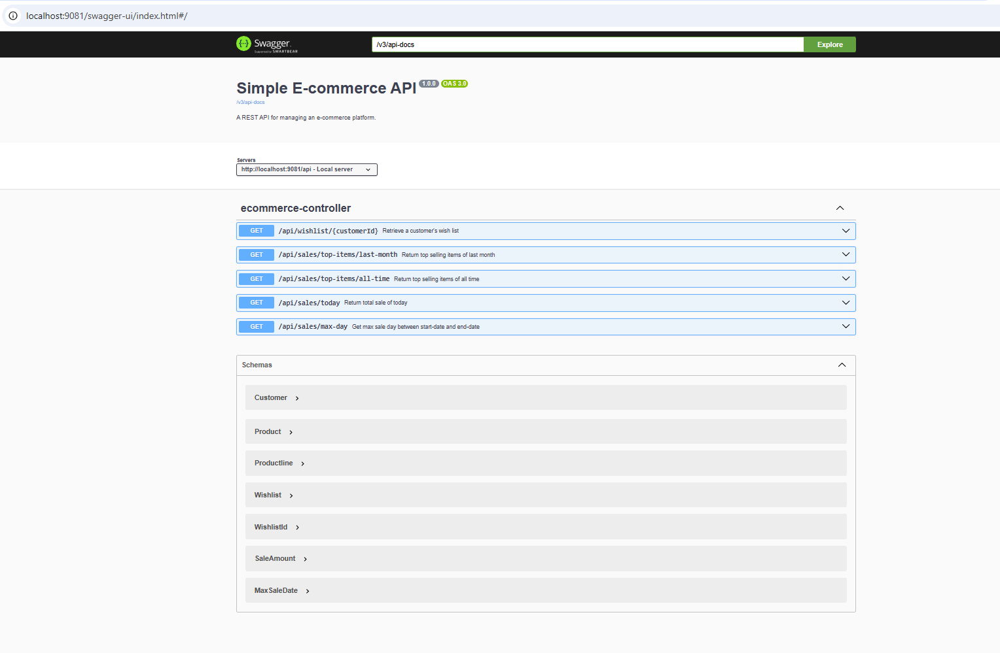
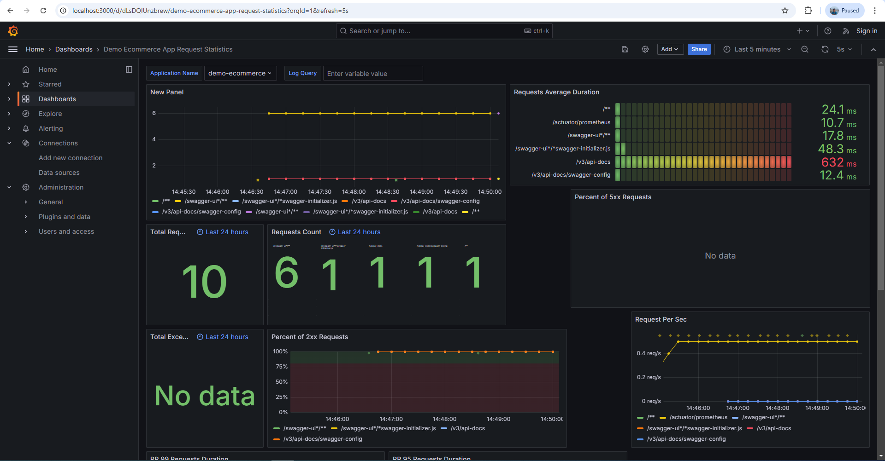
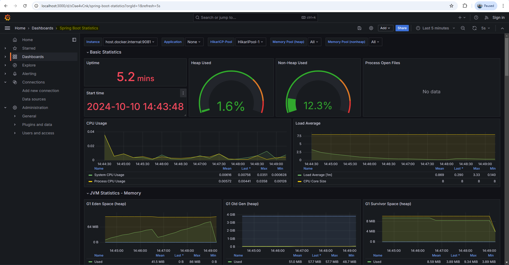

# Simple E-commerce REST API

# Table of Contents
 - [Technologies Used](#technologies-used)
 - [Features](#features)
 - [Getting Started](#getting-started)
     - [Prerequisites](#prerequisites)
     - [Installation](#installation)
     - [Database Schema](#database-schema)
 - [Screenshots](#screenshots)

# Technologies Used

 - Java 17
 - Spring Boot 3.2.2
 - Spring Data JPA
 - Hibernate
 - MySQL
 - Maven
 - Liquibase
 - OpenAPI
 - Docker
 - Spring Data REST
 - Test Containers
 - Prometheus
 - Grafana
 - Tempo

# Features

 - Retrieve a customer's wish list.
 - Get the total sales amount for the current day.
 - Determine the maximum sales day within a specified time range.
 - Fetch the top N selling items of all time based on total sales amount.
 - Get the top N selling items of the last month based on the number of sales.
 - **Integration Testing**: Utilizes Test Containers for robust integration testing.
 - **Observability**: Integrated with Prometheus, Grafana, and Tempo for monitoring and observability of the application.

# Getting Started

## Prerequisites

Ensure you have the following installed:

- **Java 17+**
- **Docker**

## Installation

Follow these steps to install and configure the project:

1. Clone the repository.
   ```bash
   git clone https://github.com/syedabdullahrahman/e-commerce.git
   ```
2. Navigate to the project directory.

3. Build the project using Maven.
```bash
mvn clean install
```
4. Run the application
```bash
java -jar target/demo-0.0.1-SNAPSHOT.jar
```

### OR

**Run the application using Docker Compose:**
  ```bash
  docker-compose up
  ```

# Screenshots

- *OpenAPI or Swagger UI for testing API*



- *Application HTTP requests metrics*




- *Application overall metrics*




### Database Schema
The database schema is from [MySQL Sample Database](https://www.mysqltutorial.org/getting-started-with-mysql/mysql-sample-database/)

Here is the schema diagram:

