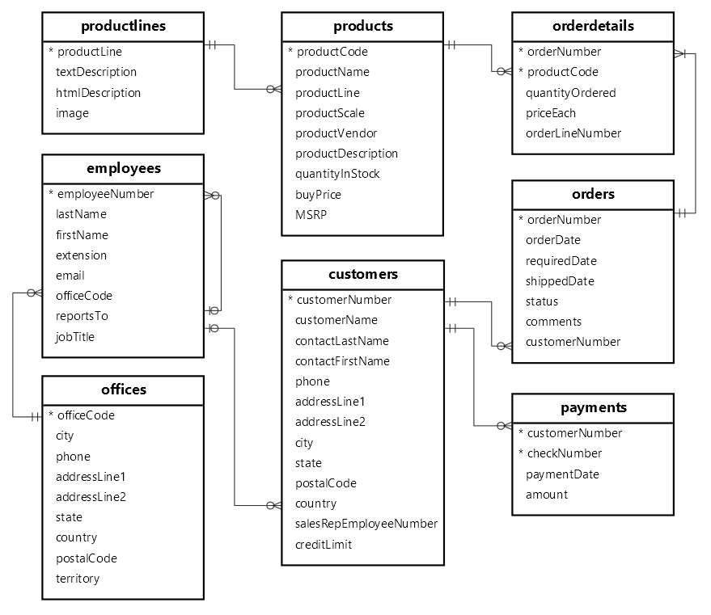

# 🌟 Simple E-commerce REST API

[](https://github.com/syedabdullahrahman/e-commerce/actions/workflows/maven.yml)

---

## 📚 Table of Contents
- [Technologies Used](#technologies-used)
- [Features](#features)
- [Getting Started](#getting-started)
  - [Prerequisites](#prerequisites)
  - [Installation](#installation)
  - [Database Schema](#database-schema)
- [Screenshots](#screenshots)
- [Contributing](#contributing)
- [License](#license)

---

## 🛠️ Technologies Used

This project leverages a variety of powerful technologies to create a seamless e-commerce experience:

- **Java 17**
- **Spring Boot 3.2.2**
- **Spring Data JPA**
- **Hibernate**
- **MySQL**
- **PostgreSQL**
- **Maven**
- **Liquibase**
- **OpenAPI**
- **Docker**
- **Spring Data REST**
- **Test Containers**
- **Prometheus**
- **Grafana**
- **Tempo**

---

## 🚀 Features

Discover the robust features of this e-commerce API:

- **Customer Wish List**: Easily retrieve and manage customer wish lists.
- **Sales Insights**: Get total sales for the current day and identify peak sales days.
- **Top Selling Items**: Fetch top N selling items of all time and for the last month based on sales metrics.
- **Integration Testing**: Robust integration testing using Test Containers for both MySQL and PostgreSQL databases, ensuring quality across different environments.
- **Observability**: Monitor application performance with Prometheus, Grafana, and Tempo.

---

## 🏁 Getting Started

### Prerequisites

Before you begin, ensure you have the following installed:

- **Java 17+**
- **Docker**

### Installation

Follow these steps to get your local environment up and running:

1. **Clone the repository**:
   ```bash
   git clone https://github.com/syedabdullahrahman/e-commerce.git
   ```
2. **Navigate to the project directory**:
   ```bash
   cd e-commerce
   ```
3. **Build the project using Maven**:
   ```bash
   mvn clean install
   ```
4. **Run the application**:
   ```bash
   java -jar target/demo-0.0.1-SNAPSHOT.jar
   ```

### OR

**Run the application using Docker Compose**:
```bash
docker-compose up
```

---

## 📸 Screenshots

Here’s a glimpse of the application in action:

- **OpenAPI / Swagger UI for API testing**
  

- **Application HTTP requests metrics**
  

- **Overall application metrics**
  

### 📊 Database Schema

The database schema is derived from the [MySQL Sample Database](https://www.mysqltutorial.org/getting-started-with-mysql/mysql-sample-database/). Here’s the schema diagram:



---

## 🤝 Contributing

We welcome contributions! If you'd like to contribute, please follow these steps:

1. Fork the repository.
2. Create a new branch (`git checkout -b feature/YourFeature`).
3. Make your changes and commit them (`git commit -m 'Add some feature'`).
4. Push to the branch (`git push origin feature/YourFeature`).
5. Open a pull request.

---

## 📝 License

This project is licensed under the MIT License - see the [LICENSE](LICENSE) file for details.

---

Feel free to reach out if you have any questions or suggestions!
